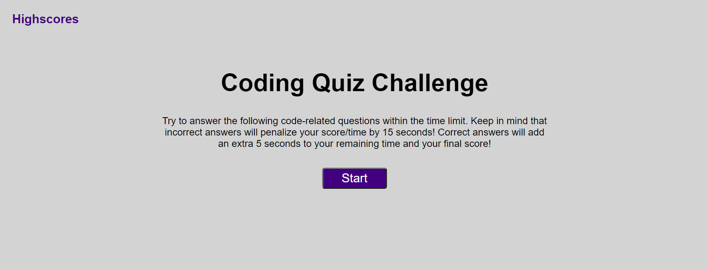
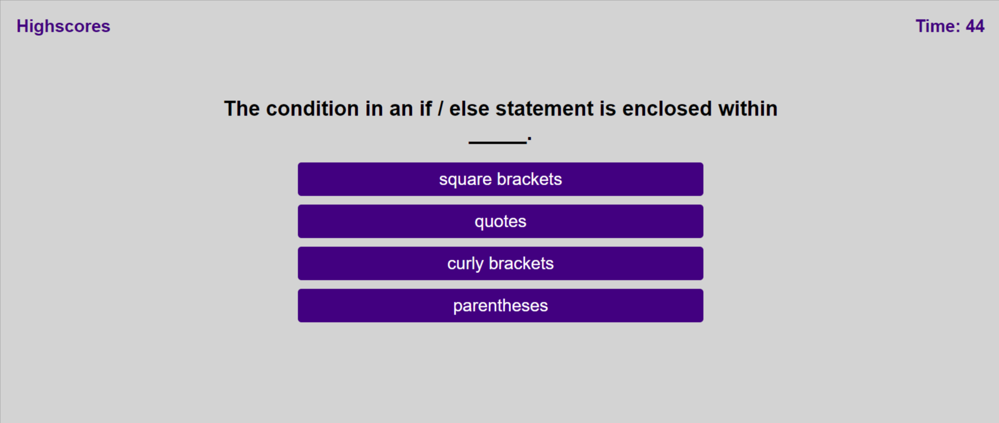
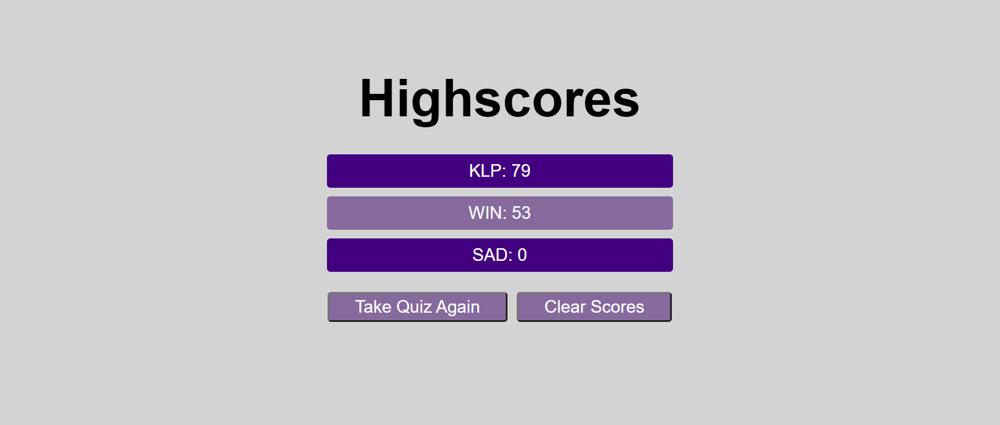

# Coding Quiz

A coding quiz game that tests users on their coding knowledge by dynamically cycling through questions and allowing users to save their scores.

## Links

[Live Website](https://kerilp.github.io/coding-quiz-challenge/)

[Source Code](https://github.com/kerilp/coding-quiz-challenge)

